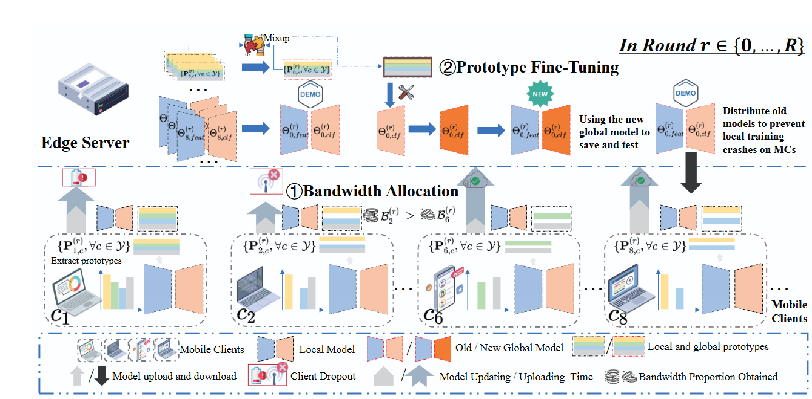

## Accelerating Federated Learning under Client Dropout via Joint Bandwidth Allocation and Prototype Fine-Tuning in Mobile Edge Computing Networks

The paper has been submitted by IEEE Trans. Mobile Comput. 


**Title:** Accelerating Federated Learning under Client Dropout via Joint Bandwidth Allocation and Prototype Fine-Tuning in Mobile Edge Computing Networks

**Author:**  Jian Tang, Luxi Cheng, Xiuhua Li, Xiaofei Wang, Derrick Wing Kwan Ng, Victor C. M. Leung


### 1. Background and Problem
This paper primarily explores challenges encountered in federated learning (FL) under client dropout within mobile edge computing (MEC) networks. It proposes a novel framework, termed BAPFT, to address two key issues:

During FL training, the edge server (ES) typically waits for updates from all mobile clients (MCs). However, when an MC drop outs, the ES may idle, wasting resources. BAPFT optimizes the deadline for each training round through adaptive bandwidth allocation, preventing ES idling and reducing MC waiting time.

Besides, client dropout and statistical heterogeneity introduce bias during global model aggregation, slowing convergence. BAPFT resolves this through prototype fine-tuning, mitigating bias and accelerating model convergence without disrupting MCs' local training.

### 2. Proposed BAPFT Framework

The proposed BAPFT framework for FL under client dropout in MEC networks. Specifically, in each round, BAPFT first allocates bandwidth to participating MCs, determines an optimal deadline, and minimizes waiting time. Subsequently, ES aggregates locally trained models and prototypes uploaded by non-dropout MCs, fine-tunes the global model's classifier using mix-up prototypes. To prevent local training stability, BAPFT distributes the unfined-tuned global model to MCs.




### 3. Experiments

You can run through the experiment with the following code

```
python main.py --server proposed
```